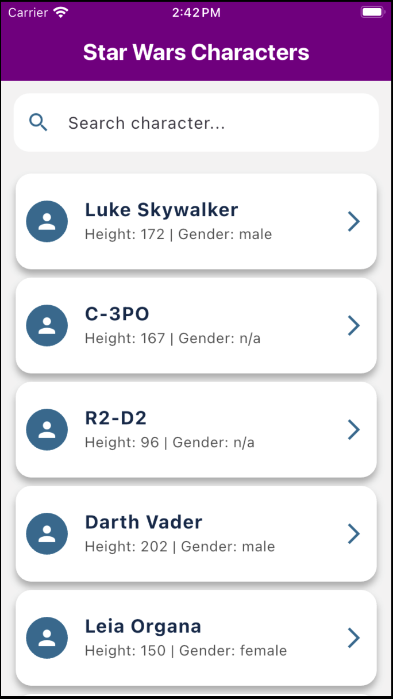
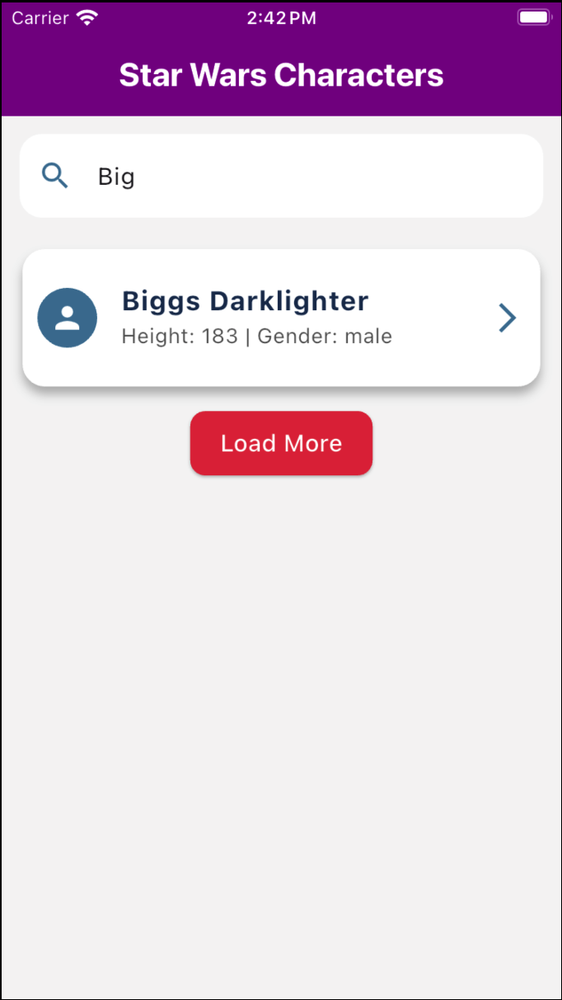
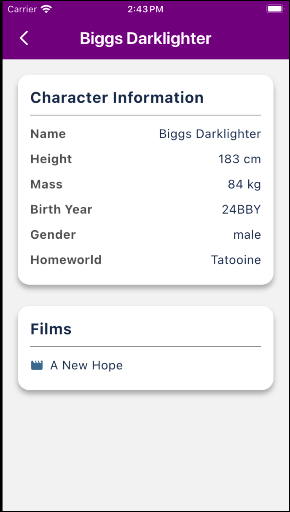

# Character Details App

This Flutter app provides detailed information about various characters, including their basic details, homeworld, and films they appeared in. It fetches data from an external API, and presents it in a clean, responsive layout. The app utilizes the **GetX** package for state management and **Obx** for real-time updates.

## Features

- **Character Information**: View details like name, height, mass, birth year, and gender.
- **Homeworld Information**: Fetches and displays the homeworld dynamically.
- **Films**: Displays a list of films in which the character appeared.
- **Responsive UI**: Supports both mobile and web applications.
- **Beautiful UI Design**: Modern card design with smooth transitions.

## Screenshots

- **API Fetching, Pagination, and Search Functionality**
- **1. API Fetching**
     - The app uses the Dio package to fetch data from the Star Wars API (https://swapi.dev/api/people/).
     - It retrieves a list of characters from the API and displays them in a list format.
     - The data contains details like the character's name, height, gender, and homeworld.
- **2. Pagination**
     - The API returns the data in pages (e.g., 10 characters per page).
     - Initially, the first page of characters is fetched when the app loads.
     - When the user scrolls to the bottom of the list, the "Load More" button triggers the app to fetch the next page of characters from the API.
     - The app automatically appends the new characters to the existing list.
- **3. Search Functionality**
     - The search bar allows users to search for characters by name.
     - When the user types, the app sends a request to the API with the search query (e.g., search="Luke").
     - The API returns characters that match the search query, and the app updates the list of characters based on the search result.
     - Note: The entire list of characters is fetched and stored in memory, not just what is shown in the UI. This allows for fast filtering and searching through the full dataset.





## Technologies Used

- **Flutter**: The framework used to build this cross-platform app.
- **GetX**: For state management and efficient data binding.
- **CustomColor**: For a beautiful, modern color scheme.
- **API Integration**: Fetching character data and displaying it dynamically.

## Installation

### Prerequisites

Make sure you have the following installed:
- Flutter SDK (Latest stable version)
- Dart SDK
- A code editor like VS Code or Android Studio

### Steps to Run the App

1. Clone this repository to your local machine:
    ```bash
    git clone https://github.com/majidbhuiyan20/Star-Wars-App.git
    ```

2. Navigate into the project directory:
    ```bash
    cd character-details-app
    ```

3. Install dependencies:
    ```bash
    flutter pub get
    ```

4. Run the app:
    ```bash
    flutter run
    ```

   For web:
    ```bash
    flutter run -d chrome
    ```

## Usage

- Once you launch the app, you'll be presented with a list of characters.
- Select a character to view detailed information like name, height, mass, and films.
- Data such as homeworld and films are fetched dynamically from an API.
- The layout is responsive and adjusts for both mobile and web.

## Directory Structure

